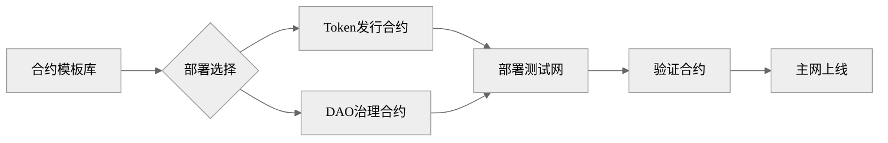

# SAT20 智能合约部署指南

```mermaid
%%{init: {'theme':'neutral','fontFamily':'Microsoft YaHei'}}%%
graph LR
    A[合约模板库] --> B{"部署选择"}
    B --> C[Token发行合约]
    B --> D[DAO治理合约]
    C --> E[部署测试网]
    D --> E
    E --> F[验证合约]
    F --> G[主网上线]
```

## 部署流程说明
1. 从智能合约模板库选择所需合约类型
2. 通过决策节点选择部署模式
3. 执行测试网部署验证
4. 完成主网最终部署
